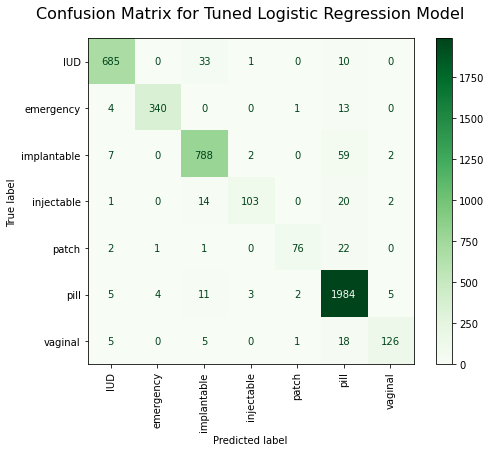

# Predicting Sentiment Toward Birth Control Methods
#### Aaron Galbraith
#### Flatiron Data Science Capstone Project
https://www.linkedin.com/in/aarongalbraith \
https://github.com/aarongalbraith
#### Submitted: November 21, 2023

## Overview

Pfizer seeks better information about the sentiment of its potential customer base toward various prescription birth control methods. We analyzed user-generated reviews of birth control drugs from drugs.com and made recommendations to Pfizer based on our findings. Pfizer can track developing trends by using our modeling tool to analyze conversations happening elsewhere online.

## Business and Data Understanding

### Business Understanding

Following the US Supreme Court ruling in [Dobbs (2022)](https://www.supremecourt.gov/opinions/21pdf/19-1392_6j37.pdf), many states began changing laws regarding reproductive health care rights. In the new reproductive environment created by this ruling, Americans who are concerned with family planning are showing greater interest in birth control options and are more likely to consume and practice the birth control methods (that remain legal) in greater numbers than before. Pfizer can capitalize on this trend by understanding public perceptions of the various methods and responding to these perceptions in their marketing.

In 2018, researchers Surya Kallumadi and Felix Gräßer at UC Irvine created the [UCI ML Drug Review Dataset](https://www.kaggle.com/datasets/jessicali9530/kuc-hackathon-winter-2018/) after collecting reviews from [Drugs.com](https://www.drugs.com/) that users had written about various drugs between 2008 and 2017. A substantial portion of these reviews addressed birth control and emergency contraception drugs.

People often share similar sentiments with each other in online spaces such as [Reddit](https://www.reddit.com/r/birthcontrol/) and [Quora](https://www.quora.com/search?q=birth%20control). Our project analyzes the Drug Review Dataset in order to 1) learn what the Dataset can tell Pfizer about sentiments toward the various methods of birth control and 2) train a model that can be applied in other online spaces to determine what birth control methods users are discussing and how they feel about them. With this tool, Pfizer can more effectively market their products to the increased demand created by the Dobbs ruling.

### Data Understanding

After a substantial amount of cleaning, the data set included 21,779 records. Each record had these features:

#### Drug Name

These labels varied greatly. Many were specific brand names, while others were generic or chemical names, or even combinations of chemical names. 

#### Condition

This feature had many missing labels. We eventually trimmed this feature to just two labels: "Birth Control" and "Emergency Contraception". In fact there was some cross-mixing of these two conditions, i.e. records labeled "Birth Control" that actually reviewed drugs for emergency contraception purposes and vice versa.

#### Method (of Birth Control)

This feature was central to our analysis, but it was not provided in the original dataset. We had to construct it by matching the various brand drug name labels to their corresponding method of birth control. ChatGPT was instrumental in the process of gathering this data.

We do not consider emergency contraception pills to be in direct competition with the other methods of birth control, so this method label was sometimes included in analysis and visual displays when comparisons seemed useful or when confusion was possible and otherwise excluded.

#### Review

This feature was the text of the review that a user posted on drugs.com. There were a great deal of duplicate reviews, as explained further below.

#### Rating

Users submitted a rating between 1 and 10 accompanying each review.

This shows the overall distribution of those ratings.

#### Date

The records spanned from February 2008 to November 2017. The number of reviews surged in 2014.

The average ratings of the methods vary over time.

#### Useful Count (Upvotes)

This feature counted the number of "upvotes" recorded by other users. This did not factor into our analysis. In further inquiry, it would be wise to note that the increase in the number of records from 2014 onward likely correlates with an increase in upvotes that does not necessarily reflect *better* reviews but simply *more* of them. Any analysis of this feature should perhaps calculate upvotes as a percentage of the total upvotes during a certain timespan, such as a day or a month.

## Data Preparation

### Duplicates, drug names, and missing condition labels

The majority of the records were entered twice: once with a brand name in the `drugName` feature and once with a generic or chemical name. *Some* of these duplicates had *one* missing condition label. By recognizing the nature of these special pairs, we were able to restore many of the missing condition labels (by matching them with their pair-mate).

For the remaining missing condition labels, we assigned the label that most commonly corresponded with the drug name listed. For example, if a record specified a drug name of "Viagra" but had no condition label, we would assign it the condition of "Erectile Dysfunction", as that was the most common condition associated with Viagra.

Once we had successfully restored as many missing condition labels as possible, we dropped the remaining records with missing condition labels and further dropped all records with condition labels other than "Birth Control" or "Emergency Contraceptive".

There were still more duplication instances beyond the special brand/generic pairs described earlier. This involved instances of the same review (unmistakably verbatim) appearing in multiple records, sometimes on different dates, usually with differing numbers of upvotes. We assumed in these cases that the same user had posted a review multiple times. We collapsed these reviews into a single record and modified the `usefulCount` to reflect the *total* number of upvotes from all instances. In at least one case, a single representative `date` label had to be chosen arbitrarily from two options that were only one day apart.

## Exploration

This shows that the pill is the dominant method, and IUDs are the next most commonly used, while most other prescription methods are not very commonly used.

This shows that some of the lesser used methods (vaginal rings and patches) enjoy quite favorable ratings. The pill is not especially highly rated. Injectables and implantables are rated the lowest of all methods.

Here is a direct comparison of the ratings for the patch and the pill (as a percentage of their overall ratings counts):

This gives an even clearer picture of how the patch dominates the pill in favorable / unfavorable ratings.

Here are word clouds of terms deemed important by TFIDF analysis to their positive and negative ratings. First the patch:

And the pill:

Some insights here: Users frequently speak *positively* about weight and body image issues (e.g. "weight", "breast") when reviewing patch methods. Users frequently refer to problems such as "acne" and "bleeding" in their negative reviews of pill methods. This juxtaposition of one method's positives against another's negatives may seem like pure [cherry picking]( https://en.wikipedia.org/wiki/Cherry_picking), but since we already know that the patch has more positive ratings and the pill has more negative ratings, the juxtaposition seems fair.

## Feature Engineering

We derived several new features from the review feature. One of the more interesting results was the "nuanced words" feature. We determined which reviews included words like "but", "although", and "nevertheless" that indicated the reviewer was engaging in even-handed reasoning. It turned out that this was somewhat predictive of the review's rating, as seen below.

A feature that was likely helpful in the method prediction model was the "brand name mention" features. We grouped the drug brand names by birth control method and constructed features for each method, indicating whether any of the brands associated with that method were mentioned in the review feature of a record. The results are below.

It's not perfect, as reviews often mentioned brands associated with other methods, but this surely helped the method prediction model a great deal.

## Modeling - Method Prediction

### Metric

The method prediction model classifies records into 7 birth control method categories. There is significant class imbalance (ranging from 45% to 2%), and we wanted to distribute the weight somewhat evenly across classes so that the little classes didn't get ignored. For this reason we chose the F1-macro scoring metric. This metric balances precision and recall for each class and weighs each class equally.

### Dummy Classifier (BASELINE)

The dummy classifier did poorly, as expected.

### Decision Tree

The decision tree classifier improved on the baseline significantly, and the tuned version did even better.

### Logistic Regression

This model and its tuned version performed better than all the rest.

### Summary of Model Performance

We experimented with some other models as well, but none of the results were as relevant as the main three mentioned above.

| Model | F1-macro | Accuracy |
| -------- | ------- | ------- |
| Dummy Classifier | 0.14 | 27.3% |
| Decision Trees (rough) | 0.82 | 87.2% |
| Decision Trees (tuned) | 0.84 | 88.3% |
| Random Forest (rough) | 0.59 | 83.3% |
| Random Forest (tuned) | 0.59 | 83.3% |
| Logistic Regression (rough) | 0.87 | 92.1% |
| Logistic Regression (tuned) | 0.90 | 94.2% |

### Confusion Matrix for Final Method Prediction Model

### Evaluation of Method Prediction Model

Our final model is the tuned logistic regression model. It returns the highest F1-macro score (0.91), which was our primary scoring metric. The F1-macro score averages F1 scores for all classes, unweighted. A weighted score might have forsaken accuracy on smaller classes (e.g. patch) in favor of scoring better on larger classes, but we wanted our model to have a more even distribution. Its overall accuracy (94%) is very impressive. The confusion matrix shows the most erroneous labels (predictably) occurring in the largest class (pill); the only other somewhat significant confusion (<5%) occurs when IUDs are confused with implantables.

## Modeling - Sentiment Prediction

### Metric

### Dummy Classifier (BASELINE)

The dummy classifier did poorly, as expected.

### Decision Tree

The decision tree classifier improved on the baseline significantly, and the tuned version did even better.

### Logistic Regression

This model and its tuned version performed better than all the rest.

### Summary of Model Performance

We experimented with some other models as well, but none of the results were as relevant as the main three mentioned above.

| Model | ROC-AUC | Recall | Accuracy |
| -------- | ------- | ------- | ------- |
| Dummy Classifier | 0.48 | 37.9% | 54.0% |
| Decision Trees (rough) | 0.69 | 55.2% | 72.6% |
| Decision Trees (tuned) | 0.75 | 80.5% | 70.8% |
| Random Forest (rough) | 0.92 | 61.3% | 82.4% |
| Random Forest (tuned) | 0.93 | 63.0% | 83.1% |
| Logistic Regression (rough) | 0.93 | 96.0% | 77.2% |
| Logistic Regression (tuned) | 0.95 | 91.3% | 86.3% |

### Confusion Matrix for Final Sentiment Prediction Model

### Evaluation of Sentiment Prediction Model

Our final model is again the tuned logistic regression model. It delivers the highest ROC-AUC score, which was our primary scoring metric. The overall accuracy of 86% is quite impressive given the class imbalance.

We also have the benefit of feature importances here. Here are the top 25 most important ones for the final model:

Although none of our engineered features appeared in the top 25 most important features for our final model, The "Nuanced Words Count" and the readability scores appeared in multiple other models' top 25 most important features. This suggests that certain composition styles can be indicative of the sentiment expressed. Unfortunately, the coefficients for these features were only captured in models that had all positive coefficients, so we are unable at this point to see which sentiment they were indicative of!

The feature importances do show that our choice to leave in common stop words such as "no" and "not" paid off in this model, as did our inclusion of bigrams.

## Recommendations

#### 1. Consider developing and marketing a patch as an alternative to the pill

Users rate the patch quite highly, but it is used much less than the pill. There is room for growth here.

#### 2. Emphasize favorable weight and body image effects of patch methods

Our word clouds and term importance analysis shows that users appreciate these aspects of the patch.

#### 3. Abandon injectable product (Depo-Provera)

This method is not commonly used and not highly rated.

#### 4. Apply our prediction models in online spaces

Look in spaces such as Reddit and Quora to gather updated data on public sentiment toward the various birth control methods.

## Further Inquiry

- Incorporate upvotes more into analysis and modeling
- Explore the possibility of a recommendation algorithm
- More feature engineering possibilities
    - whether words are in English (spelled correctly)
    - use of emoticons
    - whether it uses slang sex terms versus technical language
- Analyze evidence of reviewers switching methods or brands
- Understand what went wrong with XGB reproducibility in the multiclass model
- Scrape new text from Reddit, Quora and apply modeling to it

## Links to PDFs

Find the notebook [here](https://github.com/aarongalbraith/flatiron-phase5-project/tree/main/deliverables/notebook.pdf)

Find the presentation [here](https://github.com/aarongalbraith/flatiron-phase5-project/tree/main/deliverables/presentation.pdf)

Find the github repository [here](https://github.com/aarongalbraith/flatiron-phase5-project/tree/main/deliverables/github.pdf)

Find reproducibility notes and instructions to run the notebook [here](https://github.com/aarongalbraith/flatiron-phase5-project/tree/main/Reproducibility%20Notes.md)